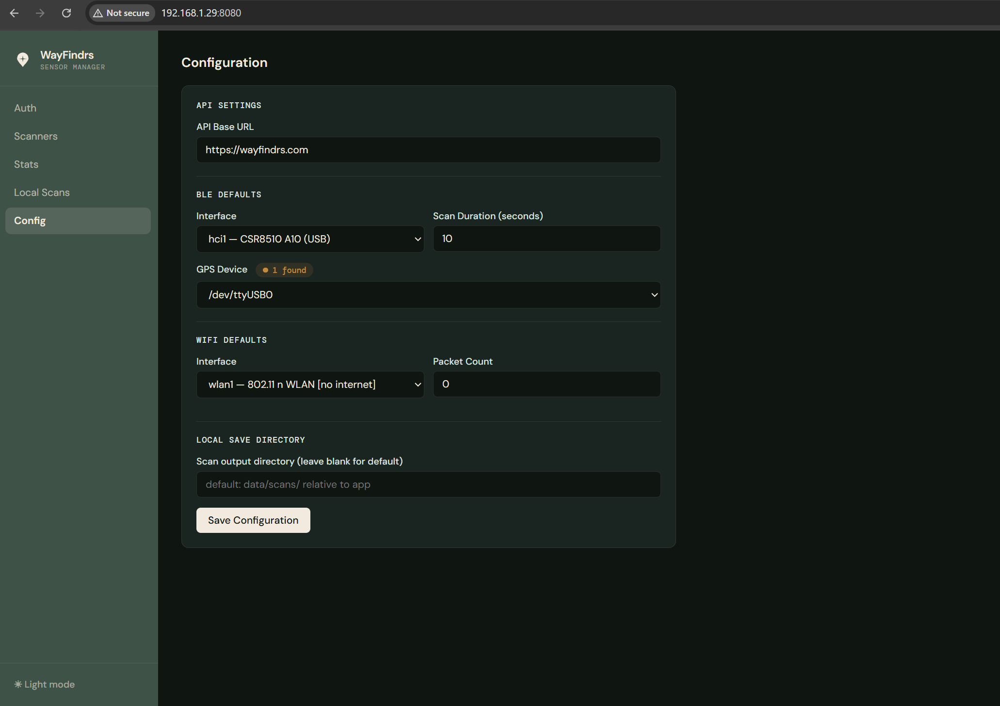
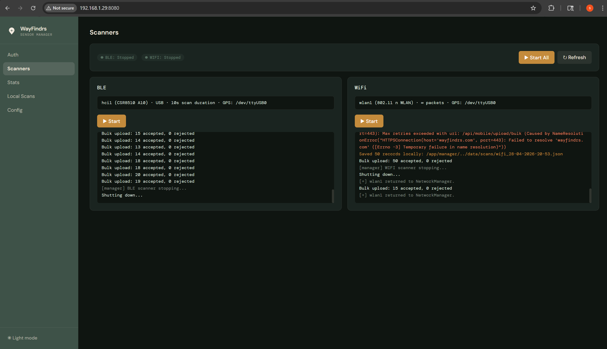

# WayFindrs Sensor Scripts

Sensor nodes and management tooling for the **WayFindrs** missing-person search network.
Each sensor scans for Bluetooth Low Energy (BLE) advertisements and WiFi probe requests,
then uploads packet metadata to the WayFindrs mobile API for analysis.

---

## Repository structure

```
WayFindrs/
├── sensor-files/
│   ├── ble_scanner.py     — BLE scanner
│   └── wifi_scanner.py    — WiFi probe-request sniffer
├── manager/
│   ├── app.py             — Flask web management server
│   └── templates/
│       └── index.html     — Manager UI
├── data/
│   ├── config.json        — Tracked default config (local changes skip-worktree'd)
│   └── scans/             — Local scan output (git-ignored)
├── .dockerignore
├── Dockerfile
├── docker-compose.yml
├── requirements.txt
└── README.md
```

---

## Components

### `ble_scanner.py` — BLE scanner

Continuously scans for nearby Bluetooth LE devices using `bluepy`.
Each advertising packet (MAC, RSSI, raw payload, GPS coordinates) is uploaded to the
WayFindrs API via a bearer-token-authenticated POST request.

**Usage**

```bash
# Login and scan
python sensor-files/ble_scanner.py \
  --api-url https://wayfindrs.com \
  --email you@example.com --password yourpassword \
  --duration 15

# Use a saved token with a GPS dongle
python sensor-files/ble_scanner.py \
  --api-url https://wayfindrs.com \
  --token eyJhbGci… \
  --gps-device /dev/ttyUSB0

# Save locally (no upload, no auth required)
python sensor-files/ble_scanner.py --local --duration 30
```

| Flag | Default | Description |
|------|---------|-------------|
| `--api-url` | `$WAYFINDRS_API_URL` or `https://wayfindrs.com` | API base URL |
| `--token` | `$WAYFINDRS_TOKEN` | Bearer token |
| `--email` / `--password` | — | Credentials to auto-obtain a token |
| `--iface` | `$WAYFINDRS_BLE_IFACE` or `hci0` | Bluetooth adapter (e.g. `hci0`, `hci1`) |
| `--duration` | `10` | Scan window per sweep in seconds |
| `--gps-device` | `$WAYFINDRS_GPS_DEVICE` | GPS serial device (e.g. `/dev/ttyUSB0`, `/dev/ttyACM0`) |
| `--output-dir` | `$WAYFINDRS_OUTPUT_DIR` or `data/scans/` | Directory for `--local` JSON output |
| `--local` / `-l` | off | Save to JSON instead of uploading |

---

### `wifi_scanner.py` — WiFi probe-request sniffer

Sniffs 802.11 probe requests in monitor mode using Scapy, with automatic channel
hopping across all 2.4 GHz and 5 GHz channels.

> **Requires root / sudo** for monitor-mode configuration.

**Usage**

```bash
# Login and sniff
sudo python sensor-files/wifi_scanner.py \
  --iface wlan1 \
  --api-url https://wayfindrs.com \
  --email you@example.com --password yourpassword

# Use a saved token, capture 500 packets then exit
sudo python sensor-files/wifi_scanner.py \
  --iface wlan1 --count 500 \
  --api-url https://wayfindrs.com --token eyJhbGci… \
  --gps-device /dev/ttyACM0

# Save locally
sudo python sensor-files/wifi_scanner.py --iface wlan1 --local
```

| Flag | Default | Description |
|------|---------|-------------|
| `--iface` / `-i` | *required* | Wireless interface in monitor mode (e.g. `wlan1`) |
| `--count` / `-c` | `0` (∞) | Packets to capture before exiting (0 = infinite) |
| `--api-url` | `$WAYFINDRS_API_URL` | API base URL |
| `--token` | `$WAYFINDRS_TOKEN` | Bearer token |
| `--email` / `--password` | — | Credentials to auto-obtain a token |
| `--gps-device` | `$WAYFINDRS_GPS_DEVICE` | GPS serial device (e.g. `/dev/ttyUSB0`, `/dev/ttyACM0`) |
| `--output-dir` | `$WAYFINDRS_OUTPUT_DIR` or `data/scans/` | Directory for `--local` JSON output |
| `--local` / `-l` | off | Save to JSON instead of uploading |

---

### Web manager (`manager/app.py`)

A lightweight Flask web interface for managing sensor scripts on a device.

**Features**
- Authenticate against the WayFindrs API (email + password, or paste a token directly)
- Start and stop the BLE and WiFi scanners with one click — Start/Stop buttons reflect actual scanner state
- Only shows adapters physically present on the machine; disables Start if no adapter is detected
- Configure scan parameters: BLE/WiFi interface, scan duration, packet count, GPS device, output directory
- GPS device auto-detection — scans `/dev/ttyUSB*` and `/dev/ttyACM*` and shows connection status
- API connectivity check — shows whether the WayFindrs API is reachable from this device and warns in the scanner summary when it is not
- View locally saved scan files, with per-file upload to the API in 50-record batches
- View your WayFindrs contribution stats (signals uploaded, sessions, streak, hours active)
- Live output log with auto-polling while a scanner is running
- Light / dark mode toggle (preference saved in browser)
- Persistent configuration stored in `data/config.json`



**Run manually**

```bash
pip install -r requirements.txt
python manager/app.py
# Open http://localhost:8080
```

---

## Authentication

The scanners use the WayFindrs mobile API (`POST /api/mobile/login`).
Tokens expire after **12 hours**. If a token expires mid-scan the scanner stops cleanly,
saves any buffered data locally, and prints a message asking you to re-authenticate.
Re-authenticate through the manager UI or by re-running a script with `--email`/`--password`.

You can also set the `WAYFINDRS_TOKEN` and `WAYFINDRS_API_URL` environment variables
to avoid passing credentials on the command line.

Packets are uploaded in bulk via `POST /api/mobile/upload/bulk` (up to 500 records per request).
Contribution stats (signals uploaded, scan sessions, streak, hours active) are derived
server-side from packet timestamps — no session management is required on the client.

---

## Offline operation & resilience

The scanners are designed to keep collecting data regardless of network conditions.

| Situation | Behaviour |
|-----------|-----------|
| API unreachable at startup | Scanner attempts to upload; first failed batch is written locally and scanning continues |
| Network drops mid-scan | Each failed upload batch is written to a local JSON file; scanning continues uninterrupted |
| Token expires (HTTP 401) mid-scan | Remaining buffered data is saved locally, scanner stops cleanly with a re-authenticate message |
| GPS fix temporarily lost | Records without coordinates are skipped and counted; a log message is printed every 10 skipped packets and again when the fix is restored |

Locally saved files appear in the **Local Scans** tab of the manager and can be uploaded to the API once connectivity is restored.

> **Note on multi-interface devices:** putting the WiFi adapter into monitor mode does not affect other network interfaces (e.g. Ethernet, a second WiFi adapter, or the onboard `wlan0`). The device can still reach the internet via those interfaces while the scanning adapter captures probe requests. The manager's connectivity check reflects whether the configured API URL is actually reachable — not just whether any adapter exists.

---

## Data format

The BLE scanner flushes after each scan sweep; the WiFi scanner batches every 50 packets.

Each record:

| Field | Type | Description |
|-------|------|-------------|
| `timestamp` | ISO 8601 string (UTC) | Capture time |
| `protocol` | `"BLE"` or `"WiFi"` | Radio type |
| `mac_address` | string | Source device MAC |
| `address_type` | `"random"` / `"public"` | MAC address type |
| `rssi` | integer (dBm) | Signal strength |
| `channel` | integer | WiFi channel (WiFi only) |
| `raw_payload` | hex string | Raw advertising / probe payload |
| `latitude` | float | Capture latitude (GPS fix required) |
| `longitude` | float | Capture longitude (GPS fix required) |

---

## Quick start with Docker

**1. Install Docker** (one-time, skip if already installed)

```bash
curl -fsSL https://get.docker.com | sh
sudo usermod -aG docker $USER
# Log out and back in, then verify:
docker --version
```

**2. Clone and start**

```bash
git clone https://github.com/WayFindrs/WayFindrs.git
cd WayFindrs
docker compose up -d
```

Then open **http://localhost:8080** in a browser and configure your adapters in the **Config** tab. Note: The manager application listens on all interfaces, so you can access it from another device on the same LAN as needed.



> **Hardware access:** The container uses `network_mode: host` and `privileged: true`
> so scanner subprocesses can reach all Bluetooth, WiFi, and USB hardware directly.
> No device mapping is required — all host devices are accessible automatically.

### Start on boot

The Docker install script (`get.docker.com`) enables the Docker systemd service automatically.
The `docker-compose.yml` sets `restart: unless-stopped`, so once you have run `docker compose up -d` for the first time, the container will start automatically on every subsequent reboot — no extra configuration needed.

To stop the container without it restarting on the next boot:

```bash
docker compose stop        # stops, won't restart until you run 'docker compose start'
docker compose start       # starts again (picks up where it left off)
docker compose down        # stops and removes the container (requires 'up -d' to recreate)
```

### Manual setup (no Docker)

**Prerequisites (Debian / Raspberry Pi OS)**

```bash
sudo apt-get install -y bluez bluetooth libbluetooth-dev wireless-tools iw iproute2 gpsd python3-dev gcc
pip3 install -r requirements.txt
```

Then run individual scripts directly (see usage above) or start the manager:

```bash
python3 manager/app.py
```

---

## Hardware

Recommended setup (Raspberry Pi 4 / 5, Raspberry Pi OS Lite 64-bit):

| Component | Notes |
|-----------|-------|
| BLE | Any USB Bluetooth 4.0+ dongle (e.g. Plugable USB-BT4LE) |
| WiFi | USB adapter with monitor-mode support required — e.g. Alfa AWUS036ACH (RTL8812AU) or Alfa AWUS036NH (RTL8188). Not all USB WiFi adapters support monitor mode. |
| GPS | Any USB GPS module — FTDI-based devices appear as `/dev/ttyUSB0`; u-blox and most modern modules appear as `/dev/ttyACM0`. Configure the path in the manager UI or via `WAYFINDRS_GPS_DEVICE`. |

A GPS device is **required** — scanning will not start without one. Both scanners wait up to 120 seconds for an initial fix before beginning; the wait log prints satellite count and best signal strength every 15 seconds so you can see whether the antenna has sky view. Signal strengths below ~25 dBHz are typically insufficient for a cold-start fix — move the antenna to a window or outside if the fix times out. Individual records captured while the GPS fix is temporarily lost are skipped (logged) rather than uploaded without coordinates.

Using dedicated external USB dongles for BLE and WiFi is recommended so that the onboard `wlan0` interface remains available for network connectivity.

---

## License

See [LICENSE](LICENSE).
